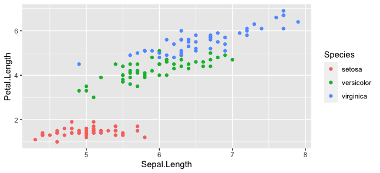

Approximate time: 120 minutes


## Basic plots in R
R has a number of built-in tools for basic graph types such as histograms, scatter plots, bar charts, boxplots and much [more](http://www.statmethods.net/graphs/). Rather than going through all of different types, we will focus on `plot()`, a generic function for plotting x-y data. 

To get a quick view of the different things you can do with `plot`, let's use the `example()` function:
```r	
example("plot")
```

Here, you will find yourself having to press `<Return>` so you can scroll through the different types of graphs generated by `plot`. Take note of the different parameters used with each command and how that affects the aesthetics of the plot. 

```r
dev.off() 
# this means "device off" and we will be going over what this does at the end of this section. 
# For now, it makes it so that when we draw plots they show up where they are supposed to?
```

### Line Charts

First we'll produce a very simple graph using the values in the `car` vector:

```r
# Define the cars vector with 5 values
cars <- c(1, 3, 6, 4, 9)

# Graph the cars vector with all defaults
plot(cars)
```


Let's add a title, a line to connect the points, and some color:

```r
# Define the cars vector with 5 values
cars <- c(1, 3, 6, 4, 9)

# Graph cars using blue points overlayed by a line 
plot(cars, type="o", col="blue")

# Create a title with a red, bold/italic font
title(main="Autos", col.main="red", font.main=4)
```


Now let's add a red line for trucks and specify the y-axis range directly so it will be large enough to fit the truck data:

```r
# Define 2 vectors
cars <- c(1, 3, 6, 4, 9)
trucks <- c(2, 5, 4, 5, 12)

# Graph cars using a y axis that ranges from 0 to 12
plot(cars, type="o", col="blue", ylim=c(0,12))

# Graph trucks with red dashed line and square points
lines(trucks, type="o", pch=22, lty=2, col="red")

# Create a title with a red, bold/italic font
title(main="Autos", col.main="red", font.main=4)
```


### Bar Charts

Let's start with a simple bar chart graphing the cars vector:

```r
# Define the cars vector with 5 values
cars <- c(1, 3, 6, 4, 9)

# Graph cars
barplot(cars)
```


### Histograms

Let's start with a simple histogram graphing the distribution of the suvs vector:

```r
# Define the suvs vector with 5 values
suvs <- c(4,4,6,6,16)

# Create a histogram for suvs
hist(suvs)
```


### Pie Charts

Let's start with a simple pie chart graphing the cars vector:

```r
# Define cars vector with 5 values
cars <- c(1, 3, 6, 4, 9)

# Create a pie chart for cars
pie(cars)
```


## Advance Plotting in R with ggplot2 

`ggplot2` is an R package used for statistical computing and data representation using data visualization. It follows underlying graphics called `Grammar of Graphics`, which includes certain rules and independent components which can be used to represent data in various formats. 


### Relationship between “Grammar of Graphics” and R

`ggplot` uses statistical graphics for mapping the data to aesthetic attributes such as color, shape, size of the concerned geometric objects like points, lines and bars. The plot may also contain various statistical transformations of the concerned data which is drawn on the mentioned coordinate system.

We can build different types of plots which can be created with reference to the grammar:

* Data
* Layers
* Scales
* Coordinate Systems
* Faceting
* Theme

To install the package, we need to run

```r
install.packages("ggplot2")
```

To load the particular package, we need to follow the below mentioned syntax −

```r
library(ggplot2)
```

Let's read our first data

```r
data(iris)
```

Plotting the iris dataset plot with ggplot2 in simpler manner involves the following syntax −

```r
iris <- ggplot(iris, aes(Sepal.Length, Petal.Length, colour=Species)) + geom_point()
print(iris)
```


Here we can modify the title, x label and y label which means x axis and y axis labels in systematic format as given below −

```r
print(iris + labs(y="Petal length (cm)", x = "Sepal length (cm)") 
      + ggtitle("Petal and sepal length of iris"))
```


### Highlight and tick marks

Plot the markers with mentioned co-ordinates of x and y axes as mentioned below. It includes adding text, repeating text, highlighting particular area and adding segment as follows −

```r
# add text
iris + annotate("text", x = 6, y = 5, label = "text")

# add repeat
iris + annotate("text", x = 4:6, y = 5:7, label = "text")

# highlight an area
iris + annotate("rect", xmin = 5, xmax = 7, ymin = 4, ymax = 6, alpha = .5)

# segment
iris + annotate("segment", x = 5, xend = 7, y = 4, yend = 5, colour = "black")
```

|                  |  | 
|:-----------------|----:|
|| | 
|| | 


### Now let's explore another dataset (i.e. PlantGrowth Dataset)

A simple plot with required x and y axis of the graph as mentioned below

```r
plant_plot <- ggplot(PlantGrowth, aes(x=group, y=weight)) + 
  geom_point()
print(plant_plot)
```


Task 1: 
`Can you please swipe x and y axes?`


### Legends in `ggplot`

Let's load the `iris` data again and plot

```r
data(iris)
iris <- ggplot(iris, aes(Sepal.Length, Petal.Length, colour=Species)) + geom_point()
print(iris)
```


Now let's remove the legend

```r
iris + theme(legend.position = "none")
```


Now let's bring it back and change the legend position to top

```r
data(iris)
iris <- ggplot(iris, aes(Sepal.Length, Petal.Length, colour=Species)) + geom_point()
iris<- iris + theme(legend.position = "top")
print(iris)
```


We can also change the font style of legends

```r
library(ggplot2)
data(iris)
iris <- ggplot(iris, aes(Sepal.Length, Petal.Length, colour=Species)) + geom_point()
print(iris)
iris <- iris + theme(legend.title = element_text(colour = "blue", size = 10))
print(iris)
iris <- iris + theme(legend.text = element_text(colour = "red", size = 10))
print(iris)
```


### Scatter Plot in R

For creating a basic scatter plot following command is executed 
```r
library(ggplot2)
data(iris)
iris <- ggplot(iris, aes(Sepal.Length, Petal.Length)) + geom_point()
print(iris)
```


We can change the shape of points with a property called shape in geom_point() function.

```r
library(ggplot2)
data(iris)
iris <- ggplot(iris, aes(Sepal.Length, Petal.Length)) + geom_point(shape = 1)
print(iris)
```


We can add color to the points which is added in the required scatter plots.

```r
library(ggplot2)
data(iris)
iris <- ggplot(iris, aes(Sepal.Length, Petal.Length, colour  = Species)) + geom_point(shape = 1)
print(iris)
```


### Smoothing and fitting regression

We will focus on establishing relationship between the variables.

`geom_smooth` function aids the pattern of overlapping and creating the pattern of required variables. The attribute method “lm” mentions the regression line which needs to be developed.

```r
library(ggplot2)
data(iris)
iris <- ggplot(iris, aes(Sepal.Length, Petal.Length, colour  = Species)) + 
  geom_point(shape = 1) +
  geom_smooth(method = lm)
print(iris)
```


We can also add a regression line with no shaded confidence region with below mentioned:

```r
library(ggplot2)
data(iris)
iris <- ggplot(iris, aes(Sepal.Length, Petal.Length, colour  = Species)) + 
  geom_point(shape = 1) +
  geom_smooth(method = lm, se = FALSE)
print(iris)
```


### Bar Plots & Histograms

Bar plots represent the categorical data in rectangular manner. The bars can be plotted vertically and horizontally. The heights or lengths are proportional to the values represented in graphs. The `x` and `y` axes of bar plots specify the category which is included in specific data set.

Histogram is a bar graph which represents the raw data with clear picture of distribution of mentioned data set.

Let's inspect the MPG dataset. This dataset contains a subset of the fuel economy data that the EPA makes available on https://fueleconomy.gov/. It contains only models which had a new release every year between 1999 and 2008 - this was used as a proxy for the popularity of the car.

```r
library(ggplot2)
mpg
```

Now let's create a first bar count plot. We will use geom_bar() function which is used for creating bar plots. It takes the attribute of statistical value called count.

```r
b_plot<-ggplot(mpg, aes(x=factor(cyl))) + geom_bar(stat = "count")
b_plot
```


Now let's create our first histogram. We will use geom_histogram(), which includes all the necessary attributes for creating a histogram. Here, it takes the attribute of hwy with respective count. The color is taken as per the requirements.


```r
ggplot(data = mpg, aes(x=hwy)) + 
  geom_histogram(col = "red",
                 fill = "green", 
                 alpha = 0.2, 
                 binwidth = 5)
```


### Box plot

The `ggplot2` library allows to make a boxplot using `geom_boxplot()`. You have to specify a quantitative variable for the Y axis, and a qualitative variable for the X axis ( a group).


```r
library(ggplot2)
 
# The mtcars dataset is natively available
# head(mtcars)
 
# A really basic boxplot.
ggplot(mtcars, aes(x=as.factor(cyl), y=mpg)) + 
    geom_boxplot(fill="slateblue", alpha=0.2) + 
    xlab("cyl")
```


***