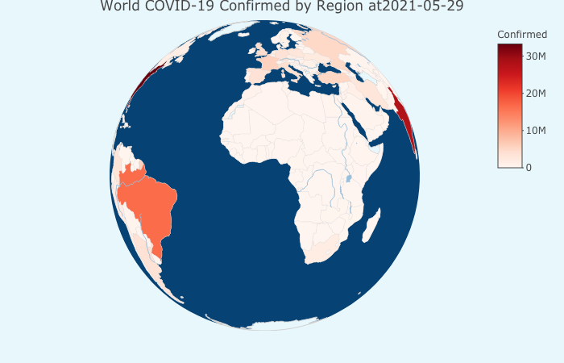
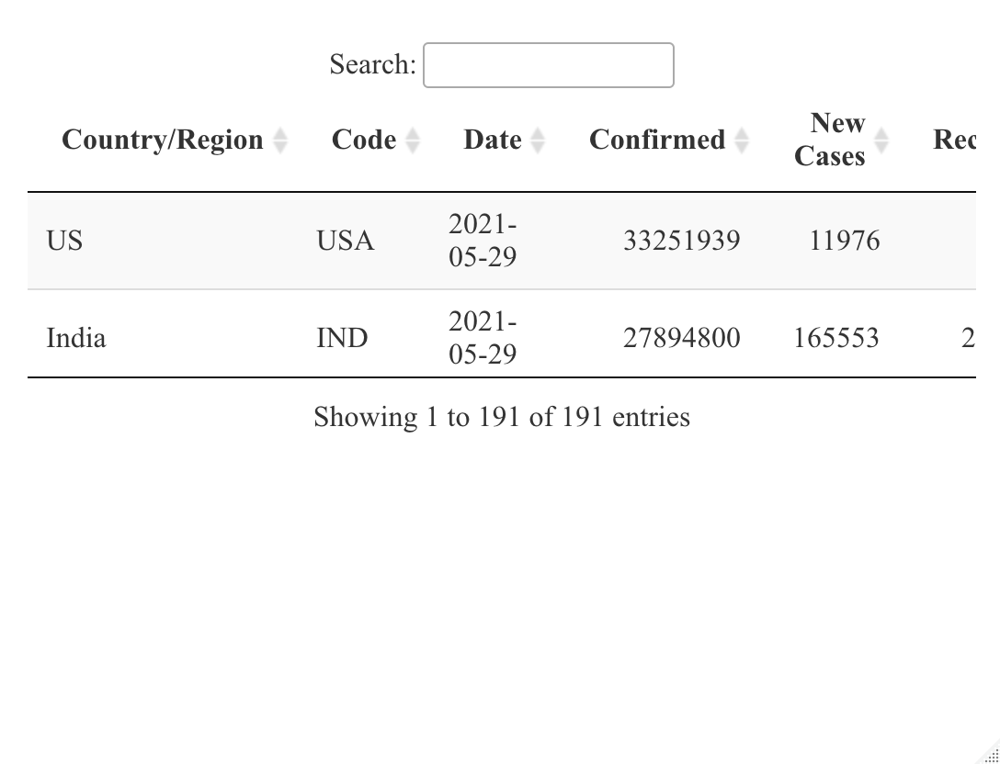
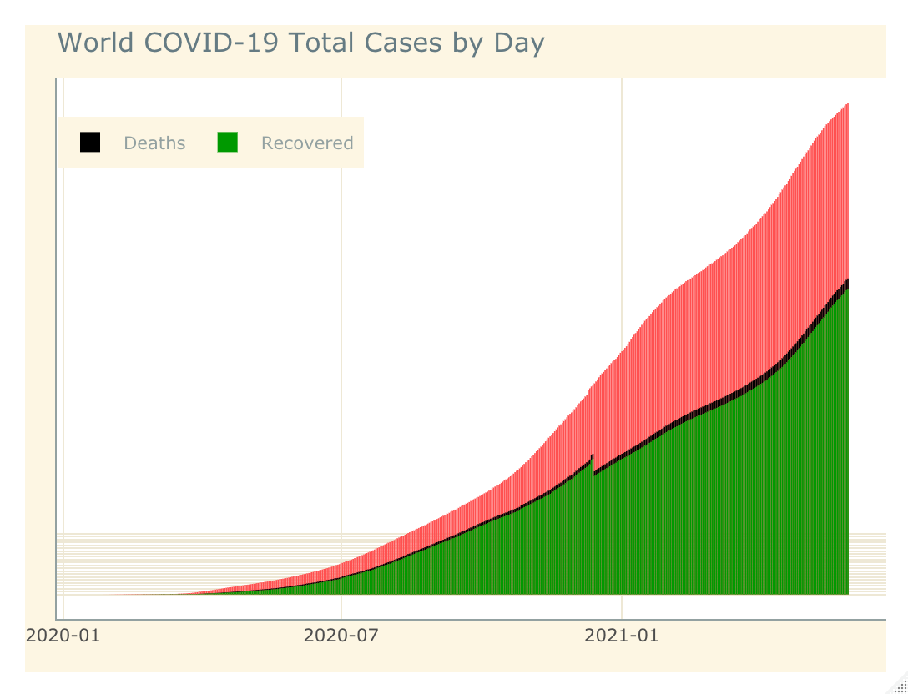
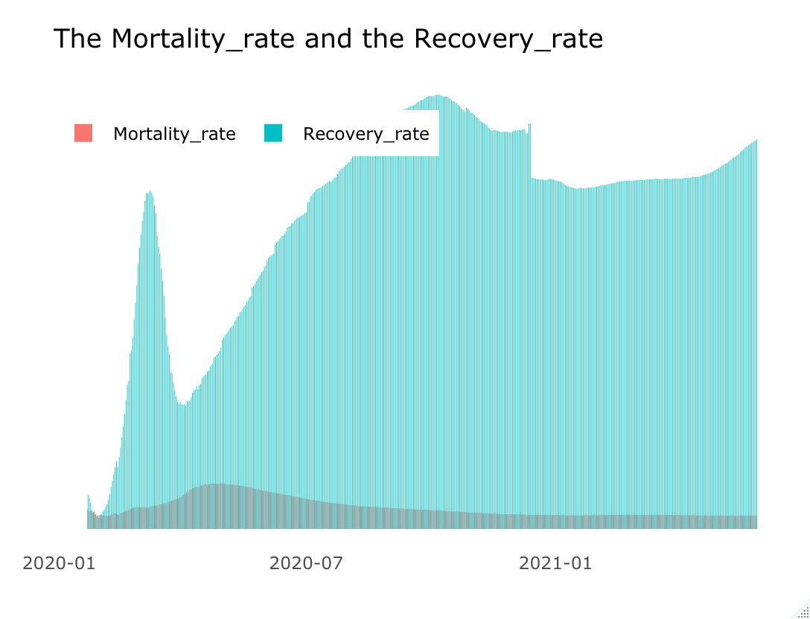

Approximate time: 120 minutes

## Introduction

Around the Feb of 2021, there were more than 113 million accumulative confirmed cases across the world. From the last two years, the whole world was fighting against the highly contagious virus that has threatened us all and we can’t assure when the turning point will be, but, please, stay calm and stay safe, we will definitely beat it.


## Load Packages

loading necessary Packages

```r	
library(readr)
library(tidyverse)
library(plotly)
library(ggthemes)
library(gganimate)
library(geosphere)
library(DT)
library(scales)
library(openair)
library(corrplot)
library(viridisLite)
library(viridis)
library(RColorBrewer)
library(ggdark)

```

## Read data

The data about COVID-19 is from https://www.kaggle.com/sudalairajkumar/novel-corona-virus-2019-dataset

The data about country code is from https://github.com/plotly/datasets/blob/master/2014_world_gdp_with_codes.csv

```r
ts_confirmed <- read_csv(file = "data/time_series_covid_19_confirmed.csv",
                         col_types = cols(
                           .default = col_double(),
                           `Province/State` = col_character(),
                           `Country/Region` = col_character()
                         ))

ts_recovered <- read_csv(file = "data/time_series_covid_19_recovered.csv",
                         col_types = cols(
                           .default = col_double(),
                           `Province/State` = col_character(),
                           `Country/Region` = col_character()
                         ))

ts_deaths <- read_csv(file = "data/time_series_covid_19_deaths.csv",
                      col_types = cols(
                        .default = col_double(),
                        `Province/State` = col_character(),
                        `Country/Region` = col_character()
                      ))

codes <- read_csv('https://raw.githubusercontent.com/plotly/datasets/master/2014_world_gdp_with_codes.csv',
                  col_types = cols(
                    COUNTRY = col_character(),
                    `GDP (BILLIONS)` = col_double(),
                    CODE = col_character()
                  ))
```

## Preprocessing data
#### Transforming the original data from wide format to long format
In the original data, a day stands for a variable(column), but they should be placed by row. So we have to get all the days together and create a variable “Date” to store them (per day per row format).

```r
ts_confirmed <- ts_confirmed %>%
  gather("Date", "Confirmed", -c("Province/State", "Country/Region", "Lat", "Long")) %>%
  mutate(Date = as.Date(Date, "%m/%d/%y"))

ts_recovered <- ts_recovered %>%
  gather("Date", "Recovered", -c("Province/State", "Country/Region", "Lat", "Long")) %>%
  mutate(Date = as.Date(Date, "%m/%d/%y"))

ts_deaths <- ts_deaths %>%
  gather("Date", "Deaths", -c("Province/State", "Country/Region", "Lat", "Long")) %>%
  mutate(Date = as.Date(Date, "%m/%d/%y"))
```

#### Creating new datasets for further analysis and visualization
We incorporated the three seperate datasets about the confirmed cases, the recovered cases and deaths. We also created a dataset including latest news of COVID-19 and a dataset including total news of COVID-19.

```r
## Incorporate datasets

ts_total <- ts_confirmed %>%
  left_join(ts_deaths) %>%
  left_join(ts_recovered) %>%
  mutate(Recovered = replace_na(Recovered, replace = 0))

## We all know "Diamond Princess" and "MS Zaandam" are cruises, So we have to remove them from the data

ts_total <- ts_total %>%
  filter(`Country/Region` != "Diamond Princess") %>%
  filter(`Country/Region` != "MS Zaandam")

ts_total$Deaths[is.na(ts_total$Deaths)] <- 0

## Created a dataset including latest news of COVID-19

cases_latest <- ts_total %>%
  group_by(`Country/Region`, Date) %>%
  summarise(Confirmed  = sum(Confirmed),
            Recovered = sum(Recovered),
            Deaths = sum(Deaths)) %>%
  mutate("New Cases" = Confirmed - lag(Confirmed, 1) ) %>%
  filter(Date == max(Date))

day_latest <- max(cases_latest$Date)

```
#### Created a dataset including total news of COVID-19

```r

cases_total_date <- ts_total %>%
  rename(Region = `Country/Region`) %>%
  group_by(Date) %>%
  summarise(Confirmed = sum(Confirmed),
            Deaths = sum(Deaths),
            Recovered = sum(Recovered)) %>%
  mutate("New_Cases" = Confirmed - lag(Confirmed, 1))

cases_total_date$New_Cases[is.na(cases_total_date$New_Cases)] <- 0 

cases_total_latest <- cases_total_date %>%
  filter(Date == max(Date))
```

## What is going on with the whole world
We should match codes for the map. Let’s find where we were in May 2021 by following the latest news.


```r
codes <- codes %>%
  select(COUNTRY, CODE) %>%
  rename(Region = COUNTRY ,
         Code = CODE) %>%
  rownames_to_column("id")

codes$id <- as.integer(codes$id)

## Making sure countries's and regions' names are in line with other datasets.

  codes$Region <- codes$Region %>%
  str_replace(pattern = "United States", replacement = "US") %>%
  str_replace(pattern = "Macedonia", replacement = "North Macedonia") %>%
  str_replace(pattern = "Czech Republic", replacement = "Czechia") %>%
  str_replace(pattern = "Taiwan", replacement = "Taiwan*") %>%
  str_replace(pattern = "West Bank", replacement = "West Bank and Gaza") %>%
  str_replace(pattern = "Congo, Democratic Republic of the", replacement = "Congo (Kinshasa)") %>%
  str_replace(pattern = "Congo, Republic of the", replacement = "Congo (Brazzaville)") %>%
  str_replace(pattern = "Bahamas, The", replacement = "Bahamas") %>%
  str_replace(pattern = "Swaziland", replacement = "Eswatini") %>%
  str_replace(pattern = "Gambia, The", replacement = "Gambia")

cases_latest_codes <- cases_latest %>%
  left_join(codes, by = c("Country/Region" = "Region" )) %>%
  arrange(desc(Confirmed))
```
The interactive 3D global map shows us vividly thoes who are suffering the most. You can rotate it to see the whole picture.

```r
## Setting boundries' color as light grey

line <- list(color = toRGB("#d1d1d1"), width = 0.2)

## Specifing parameters of the 3D map
geo <- list(
  showframe = FALSE,
  showcoastlines = FALSE,
  projection = list(type = 'orthographic'),
  resolution = '100',
  showcountries = TRUE,
  countrycolor = '#d1d1d1',
  showocean = TRUE,
  oceancolor = '#064273',
  showlakes = TRUE,
  lakecolor = '#99c0db',
  showrivers = TRUE,
  rivercolor = '#99c0db',
  bgcolor = '#e8f7fc')

plot_geo() %>%
  layout(geo = geo,
         paper_bgcolor = '#e8f7fc',
         title = paste0("World COVID-19 Confirmed by Region at", day_latest)) %>%
  add_trace(data = cases_latest_codes,
            z = ~Confirmed,
            colors = "Reds",
            text = ~'Country/Region',
            locations = ~Code,
            marker = list(line = line))
```


### Quick search of the country/region 

Datatable for quick search of the country/region you are interested in.

You Can Search by Country/Region

```r
cases_latest_codes %>%
  select(`Country/Region`,Code, Date, Confirmed, `New Cases`, Recovered, Deaths) %>%
  arrange(desc(Confirmed)) %>%
  datatable(
    rownames = FALSE,
    fillContainer = TRUE,
    options = list(
      bPaginate = FALSE)
  )
```


## COVID-19’s spread all the world
### Total cases by date
This is a interactive barchart, you can just click the part you like.

```r
cases_all <- cases_total_date %>%
  select(-Confirmed, -New_Cases) %>%
  gather("Status", "Cases", -"Date")

barchart <- ggplot(data = cases_total_date, aes(x = Date)) +
  geom_bar(aes(y = Confirmed), position = "stack", stat = "identity", fill = "#ff5050") +
  geom_bar(data = cases_all, aes(y = Cases, fill = Status), position = "stack", stat = "identity") +
  scale_fill_manual(values = c("#000000", "#009900")) +
  scale_y_continuous(breaks = seq(0, 21000000, by = 1000000), labels = comma) +
  theme_solarized(base_size = 10, light = TRUE)+
  theme(plot.margin = margin(0, 0, 0, 0, "pt"),
        panel.background = element_rect(fill = "White"),
        legend.position = "bottom",
        axis.title = element_blank(),
        axis.text.y = element_blank(),
        axis.ticks = element_blank()) +
  ggtitle("World COVID-19 Total Cases by Day")

ggplotly(barchart) %>%
  layout(legend = list(orientation = 'h'))
```




### Motality rate and recovery rate
This is also a interactive plot to show you specifically the mortality rate and recovery rate in average. You can click to see all details.

We can see the mortality rate is incresing slowly but steadily, which can’t be a good sign. The recovery rate, however is unstable by the time, but we can see it has been going up obviously from April.

```r
cases_total_date <- cases_total_date %>%
  group_by(Date, Confirmed) %>%
  mutate(Mortality_rate = Deaths / Confirmed,
         Recovery_rate = Recovered / Confirmed) %>%
  ungroup()
  ```
  
  ```r
  barchart_1 <-cases_total_date %>%
  select(Date, Mortality_rate, Recovery_rate) %>%
  gather(status.ratio, ratio, -Date ) %>%
  ggplot(aes(x = Date, y = ratio, fill = status.ratio)) +
  geom_bar(stat = "identity", position = "dodge") +
    theme(plot.margin = margin(0, 0, 0, 0, "pt"),
          panel.background = element_rect(fill = "White"),
          legend.position = "bottom",
          axis.title = element_blank(),
          axis.text.y = element_blank(),
          axis.ticks = element_blank()) +
    ggtitle("The Mortality_rate and the Recovery_rate")

ggplotly(barchart_1) %>%
layout(legend = list(orientation = 'h'))
```


  
## Visualization of some representative countries/regions
Now, let us move to some countries/regions whose situations are deeply concerned by us.

#### Top 10 countries/regions (Confirmed&Deaths&Recovered)

```r
top_10_confirmed <- cases_latest %>%
  select('Country/Region', Confirmed) %>%
  arrange(desc(Confirmed))

top_10_confirmed[1:10,] %>%
  ggplot(aes(x = reorder(`Country/Region`,Confirmed), y = Confirmed )) +
  geom_bar(stat = "identity", fill  = "red", width = 0.8) +
  theme_economist() +
  scale_y_continuous(breaks = seq(0, 5500000, by = 500000), labels = comma) +
  coord_flip() +
  labs(x = "", y = "", title = "Top 10 (the Most Confirmed Cases)") +
  theme(axis.text.x = element_text(angle = 90)) +
  theme(axis.title = element_text(size = 11, colour = "black"),
        axis.text.y = element_text(size = 11, face = "bold"))
```

```r
top_10_Deaths <- cases_latest %>%
  select('Country/Region', Deaths) %>%
  arrange(desc(Deaths))

top_10_Deaths[1:10,] %>%
  ggplot(aes(x = reorder(`Country/Region`,Deaths), y = Deaths )) +
  geom_bar(stat = "identity", fill  = "blue", width = 0.8) +
  theme_economist() +
  scale_y_continuous(breaks = seq(0, 200000, by = 20000), labels = comma) +
  coord_flip() +
  labs(x = "", y = "", title = "Top 10 (the Most Deaths)") +
  theme(axis.text.x = element_text(angle = 90)) +
  theme(axis.title = element_text(size = 11, colour = "black"),
        axis.text.y = element_text(size = 11, face = "bold"))
```

***